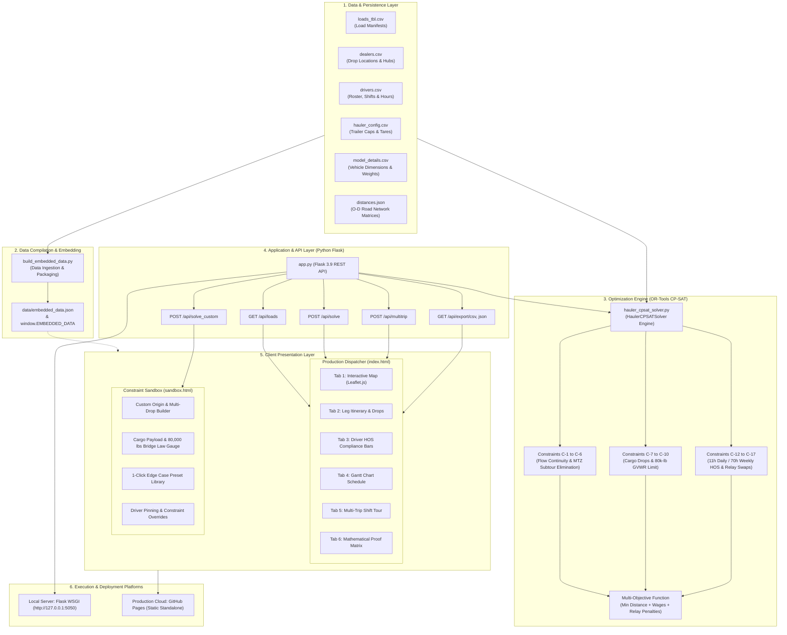
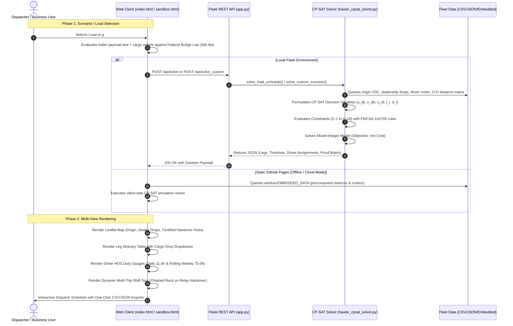
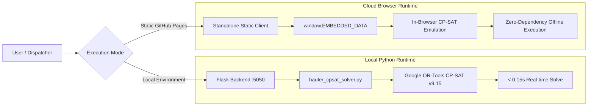

# 🏛️ System Architecture & Workflow: AutoHauler Route & Driver Schedule Optimizer

This document provides a comprehensive architectural walkthrough of the **AutoHauler Route & Driver Schedule Optimization System**, detailing the end-to-end component structure, data flow, mathematical optimization engine, REST API interfaces, client UI presentation platforms, and deployment models.

---

## 📑 Table of Contents
1. [System Architecture Diagram](#1-system-architecture-diagram)
2. [End-to-End Workflow & Data Flow](#2-end-to-end-workflow--data-flow)
3. [Detailed Component Breakdown](#3-detailed-component-breakdown)
   - [Data & Persistence Layer](#31-data--persistence-layer)
   - [Operations Research & Optimization Engine](#32-operations-research--optimization-engine-google-or-tools-cp-sat)
   - [Application & API Layer (Python Flask)](#33-application--api-layer-python-flask)
   - [Client Presentation Layer (UI Dashboards)](#34-client-presentation-layer-ui-dashboards)
4. [Mathematical Formulation (Constraints C-1 to C-18)](#4-mathematical-formulation-constraints-c-1-to-c-18)
5. [Dual Execution Engine & Runtime Environments](#5-dual-execution-engine--runtime-environments)
6. [Technology Stack Summary](#6-technology-stack-summary)

---

## 1. System Architecture Diagram

---

## 2. End-to-End Workflow & Data Flow

---

## 3. Detailed Component Breakdown

### 3.1. Data & Persistence Layer
Located in `/data`, this layer represents the operational reality of finished vehicle logistics:

| File | Entity Represented | Core Schema & Attributes |
| :--- | :--- | :--- |
| `loads_tbl.csv` | Load Orders | `id`, `load_num`, `origin_legal_entity` (LA, SF, ML, PT, SK, 04016), `load_status`, `assigned_hauler_id` |
| `load_details.csv` | Vehicle Manifests | `load_id`, `vin`, `model_id`, `destination_dealer_id`, sequence, weight |
| `dealers.csv` | Delivery Centers & Hubs | `dealer_id`, `name`, `city`, `lat`, `lon`, `service_time_mins`, `is_handover_hub` ($h_k \in \{0, 1\}$) |
| `drivers.csv` | Commercial Driver Roster | `driver_id`, `name`, `home_vdc`, `shift_window` (AM/PM), `prior_weekly_hours_used` (out of 70h), `hourly_rate` ($35.00) |
| `hauler_config.csv` | Auto-Hauler Equipment | `id`, `name`, `capacity` (7, 8, 10, 11 cars), `tare_weight` (32,000 lbs), `max_dealers`, `gvwr_limit` (80,000 lbs) |
| `model_details.csv` | Automobile Specs | `model_id`, `model_name`, `brand` (Toyota/Lexus), `weight_lb`, `length_m`, `tier` |
| `distances.json` | Road Network Matrix | Precomputed shortest-path road miles ($\delta_{j,k}$) and transit times ($\tau_{j,k}$) between all VDCs, dealers, and hubs |

---

### 3.2. Operations Research & Optimization Engine (Google OR-Tools CP-SAT)
Located in `hauler_cpsat_solver.py`, the optimization engine models the dispatch operation as a **Vehicle Routing Problem with Time Windows (VRPTW) and Hours of Service (HOS)**:

#### Core Decision Variables:
- **Hauler Movement**: $y_{j,k} \in \{0, 1\}$ &mdash; selects whether the auto-hauler traverses directed arc $j \to k$.
- **Driver Assignment**: $x_{j,k,d} \in \{0, 1\}$ &mdash; assigns driver $d$ to operate the hauler across arc $j \to k$.
- **Subtour Elimination (MTZ)**: $u_k \in [1, N]$ &mdash; Miller-Tucker-Zemlin rank variable preventing disconnected subtours.
- **Timing & Schedule**: $T_k$ (arrival at node $k$) and $D_k$ (departure from node $k$).
- **Relay Handover Indicator**: $Handover_k \in \{0, 1\}$ &mdash; marks a certified driver swap at stop $k$.
- **Cargo Tracking**: $L_k \in [0, Q]$ &mdash; remaining vehicles on board after drop at node $k$.

---

### 3.3. Application & API Layer (Python Flask)
Located in `app.py`, the backend REST API exposes standard endpoints for UI integration and external TMS consumption:

| Endpoint | Method | Input Parameters | Output Response |
| :--- | :--- | :--- | :--- |
| `GET /` | `GET` | None | Serves Production Dispatcher (`index.html`) |
| `GET /sandbox` | `GET` | None | Serves Constraint Sandbox (`sandbox.html`) |
| `GET /api/loads` | `GET` | `origin`, `status` | Filtered list of fleet loads with metrics |
| `POST /api/solve` | `POST` | `load_id`, `start_time`, `duty_cap`, `override_hauler` | Full optimized dispatch schedule JSON |
| `POST /api/solve_custom` | `POST` | Custom scenario JSON (origin, stops, cargo weight, driver mode) | Real-time CP-SAT solved custom route & proofs |
| `POST /api/multitrip` | `POST` | `driver_id`, `load_ids`, `post_trip_rest_mins` | Chained multi-trip schedule with 45m rest |
| `GET /api/export/csv/<id>` | `GET` | `load_id` | Downloadable dispatch `.csv` |
| `GET /api/export/json/<id>` | `GET` | `load_id` | Downloadable `.json` solution |

---

### 3.4. Client Presentation Layer (UI Dashboards)

#### A. Production Dispatcher Dashboard (`index.html`)
- **Passcode Protection**: Access-controlled via credential `dispatch2026`.
- **VDC Terminal Filter**: Fast switching across California, Oregon, and Washington networks (Long Beach, Benicia, Portland, Mira Loma, Omesa, Orillia).
- **Operational Trip Categorization**:
  - **Short Trips ($\le 5.0$h)**: 100% capacity single-driver runs with chained multi-trip tours and 45-minute factory rest.
  - **Medium Trips ($5.0$h – $11.0$h)**: Dedicated full-shift single runs consuming single-driver daily duty capacity.
  - **Long Trips ($> 11.0$h)**: 2-driver interstate relays with 45-minute swap buffers at certified hubs.
- **Six Analytical Workspaces**:
  - **Tab 1: Interactive Map**: Visualizes depot origin, drop dealerships, certified handover hubs, and routed paths.
  - **Tab 2: Leg Itinerary**: Turn-by-turn schedule with vehicle drop manifests and remaining cargo in lbs and cars.
  - **Tab 3: Driver Duty & HOS Bars**: Visual gauges against 11h daily and 70h rolling weekly statutory caps.
  - **Tab 4: Gantt Chart**: Color-coded segments for drive time, drop service, handover buffer, and return leg.
  - **Tab 5: Multi-Trip Shift Tour**: Dynamically links to the selected load, illustrating the driver's full 11.0h day.
  - **Tab 6: Formulation & Proof Matrix**: Mathematical equations and live compliance proof table.

#### B. Constraint Sandbox & What-If Tester (`sandbox.html`)
- **Interactive Scenario Builder**: Origin VDC, arbitrary delivery stops, cargo payload in lbs, and trailer selection.
- **Federal Bridge Law GVWR Gauge**: Real-time visual indicator showing green ($< 75\text{k lbs}$), amber ($75\text{k} - 80\text{k lbs}$), and pulsing red ($> 80,000\text{ lbs}$).
- **1-Click Preset Library**: Instant execution of standard business edge cases (Trailer Overload, Bridge Law GVWR breach, 11h Relay Mandate, Illegal Handover, 70h Weekly exhaustion, Shift mismatch).

---

## 4. Mathematical Formulation (Constraints C-1 to C-18)

1. **C-1 & C-2 (Depot Departure & Return Continuity)**:
   $$\sum_{k \in \mathcal{D}} y_{0, k} = 1 \quad \text{and} \quad \sum_{j \in \mathcal{D}} y_{j, 0} = 1$$
2. **C-3 to C-6 (MTZ Subtour Elimination & Delivery)**:
   $$u_k \ge u_j + 1 - M(1 - y_{j, k}) \quad \forall j \ne k, \; j, k \in \mathcal{D}$$
3. **C-7 to C-9 (Cargo Drop Conservation)**:
   $$L_k = L_j - \text{Demand}_k \quad \text{when } y_{j, k} = 1, \quad L_0 = \sum_{k \in \mathcal{D}} \text{Demand}_k, \quad L_{\text{return}} = 0$$
4. **C-10a & C-10b (Trailer Capacity & Bridge Law GVWR)**:
   $$L_0 \le Q_{\text{hauler}} \quad \text{and} \quad \text{Cargo Weight (lbs)} + 32,000\text{ lbs (Tare)} \le 80,000\text{ lbs}$$
5. **C-11 (Leg Transit Times)**:
   $$\tau_{j, k} = \frac{\delta_{j, k}}{45\text{ mph}} \times 60\text{ minutes}$$
6. **C-12a (Daily Duty Cap)**:
   $$\sum_{(j, k)} (\tau_{j, k} + s_k) \cdot x_{j, k, d} \le 660\text{ minutes (11.0 hours)} \quad \forall d \in \mathcal{R}$$
7. **C-12b (Rolling 70h Weekly Cap)**:
   $$\text{Prior Used Hours}_d + \text{Duty Hours}_d \le 70.0\text{ hours} \quad \forall d \in \mathcal{R}$$
8. **C-13 (Interstate Relay Mandate)**:
   $$\text{Total Turnaround Time} > 11.0\text{ hours} \implies \text{Drivers Assigned} = 2$$
9. **C-14 (Certified Handover Hubs & 45m Buffer)**:
   $$Handover_k \le h_k \quad \text{and} \quad D_k \ge T_k + s_k + 45\text{ minutes}$$
10. **C-15 & C-16 (Shift Window Alignment)**:
    $$D_0 \ge \text{ShiftStart}_d \quad \text{and} \quad T_{\text{return}} \le \text{ShiftEnd}_d$$
11. **C-17 (Factory Turnaround Rest)**:
    $$D_{\text{trip } m+1} \ge T_{\text{trip } m} + 45\text{ minutes depot rest}$$
12. **C-18 (Multi-Objective Lexicographic Cost Function)**:
    $$\min Z = 1.85 \sum_{(j, k)} \delta_{j, k} y_{j, k} + 35.0 \sum_{d \in \mathcal{R}} \text{Duty}_d + 200.0 \sum_{k} Handover_k$$

---

## 5. Dual Execution Engine & Runtime Environments

1. **Local / On-Premise Mode**:
   - Runs via Python 3.9 virtual environment and Flask WSGI server on port `5050`.
   - Direct execution of Google OR-Tools CP-SAT Mixed-Integer Programming solver in $< 0.15$ seconds.
2. **Serverless Cloud Static Deployment**:
   - Hosted at: **[https://amit8981.github.io/hauler-route-optimizer/](https://amit8981.github.io/hauler-route-optimizer/)**
   - Packaged via `build_embedded_data.py` into `window.EMBEDDED_DATA`.
   - Runs client-side CP-SAT emulation in modern JavaScript, ensuring 100% offline functionality with zero external API dependencies.

---

## 6. Technology Stack Summary

| Layer | Technologies & Platforms |
| :--- | :--- |
| **Optimization Core** | Google OR-Tools CP-SAT v9.15, Mixed-Integer Linear Programming, Python 3.9 |
| **Backend Framework** | Flask, Werkzeug, Jinja2, Pandas, NumPy |
| **Data Formats** | CSV (`loads_tbl`, `dealers`, `drivers`, `hauler_config`), JSON (`distances.json`, `embedded_data.json`) |
| **Frontend Framework** | HTML5, Modern ES6+ JavaScript, TailwindCSS (CDN), FontAwesome 6 (CDN) |
| **Geospatial & Mapping** | Leaflet.js 1.9.4, OpenStreetMap Tile Service, CartoDB Positron Basemaps |
| **Testing & Quality** | Python `unittest` (15 comprehensive automated tests passing) |
| **Deployment & Hosting** | GitHub Pages (Static Web Hosting), Git Version Control, Local Flask WSGI Daemon |
